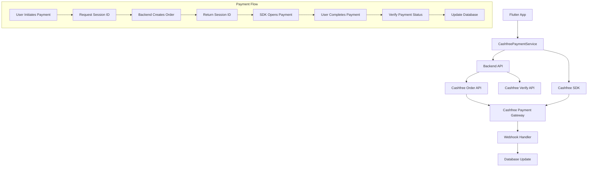

# Design Document

## Overview

This design document outlines the integration of Cashfree Payment Gateway into the existing Flutter TV subscription app. The integration will replace the current UPI intent-based payment system with Cashfree's comprehensive payment solution while maintaining the existing payment architecture and security standards.

The design ensures in-app payment processing using the official Cashfree SDK, proper backend validation, webhook handling, and seamless integration with the existing payment models and services.

## Architecture

### High-Level Architecture



### Security Architecture

- **Backend-Only Secrets**: App ID and Secret Key stored only on backend
- **Session-Based Authentication**: Frontend receives only payment_session_id
- **Webhook Verification**: All payment status updates verified through webhooks
- **API Verification**: Double verification using Cashfree Verify API
- **Environment Separation**: Sandbox keys for testing, production keys for live

## Components and Interfaces

### 1. CashfreePaymentService

Primary service class that handles all Cashfree payment operations.

```dart
class CashfreePaymentService {
  // Core payment processing
  Future<CashfreePaymentResult> processPayment({
    required String userId,
    required double amount,
    required PaymentMethod method,
    double extraCharges = 0.0,
    String? note,
  });
  
  // Session management
  Future<String> createPaymentSession({
    required String userId,
    required double amount,
    required String orderId,
  });
  
  // Payment verification
  Future<PaymentVerificationResult> verifyPayment(String orderId);
  
  // Webhook handling
  Future<bool> handleWebhook(Map<String, dynamic> webhookData);
}
```

### 2. CashfreeBackendService

Backend service for server-to-server communication with Cashfree APIs.

```dart
class CashfreeBackendService {
  // Order creation
  Future<CashfreeOrderResponse> createOrder({
    required String orderId,
    required double amount,
    required String customerId,
    required String customerPhone,
    required String customerEmail,
  });
  
  // Payment verification
  Future<CashfreePaymentStatus> getPaymentStatus(String orderId);
  
  // Webhook signature verification
  bool verifyWebhookSignature(String signature, String body);
}
```

### 3. CashfreeConfigService

Configuration management for different environments.

```dart
class CashfreeConfigService {
  static const String sandboxBaseUrl = 'https://sandbox.cashfree.com/pg';
  static const String productionBaseUrl = 'https://api.cashfree.com/pg';
  
  String get baseUrl;
  String get appId;
  String get secretKey;
  bool get isSandbox;
}
```

### 4. Enhanced Payment Models

Extension of existing PaymentModel to support Cashfree-specific fields.

```dart
enum PaymentMethod { 
  UPI, 
  CASH, 
  WALLET, 
  COMBINED, 
  CASHFREE_CARD,
  CASHFREE_UPI,
  CASHFREE_NETBANKING,
  CASHFREE_WALLET
}

class PaymentModel {
  // Existing fields...
  
  // Cashfree-specific fields
  final String? cashfreeOrderId;
  final String? cashfreePaymentId;
  final String? cashfreeSessionId;
  final String? paymentGateway;
  final String? bankReference;
  final Map<String, dynamic>? gatewayResponse;
}
```

## Data Models

### CashfreeOrderRequest

```dart
class CashfreeOrderRequest {
  final String orderId;
  final double orderAmount;
  final String orderCurrency;
  final CustomerDetails customer;
  final OrderMeta orderMeta;
  final List<String> paymentMethods;
  final String returnUrl;
  final String notifyUrl;
}
```

### CashfreePaymentResponse

```dart
class CashfreePaymentResponse {
  final String orderId;
  final String paymentSessionId;
  final PaymentStatus paymentStatus;
  final String? cfPaymentId;
  final String? paymentMethod;
  final String? bankReference;
  final double? paymentAmount;
  final DateTime? paymentTime;
  final String? failureReason;
}
```

### WebhookPayload

```dart
class WebhookPayload {
  final String eventType;
  final String orderId;
  final String paymentSessionId;
  final PaymentData data;
  final String signature;
  final DateTime timestamp;
}
```

## Error Handling

### Error Categories

1. **Network Errors**: Connection timeouts, network unavailability
2. **API Errors**: Invalid requests, authentication failures
3. **Payment Errors**: Insufficient funds, payment declined
4. **Validation Errors**: Invalid input data, missing required fields
5. **System Errors**: SDK initialization failures, configuration errors

### Error Response Structure

```dart
class CashfreeError {
  final String code;
  final String message;
  final String? description;
  final Map<String, dynamic>? details;
  final ErrorType type;
}

enum ErrorType {
  network,
  api,
  payment,
  validation,
  system
}
```

### Error Handling Strategy

- **Graceful Degradation**: Fallback to existing UPI intent system if Cashfree fails
- **User-Friendly Messages**: Convert technical errors to user-understandable messages
- **Retry Logic**: Automatic retry for transient network errors
- **Logging**: Comprehensive error logging for debugging
- **Fallback Options**: Alternative payment methods when primary method fails

## Testing Strategy

### Unit Testing

1. **Service Layer Tests**
   - CashfreePaymentService method testing
   - Mock API responses and error scenarios
   - Payment flow validation
   - Error handling verification

2. **Model Tests**
   - Data serialization/deserialization
   - Validation logic testing
   - Edge case handling

3. **Configuration Tests**
   - Environment-specific configuration loading
   - Security key validation
   - URL construction testing

### Integration Testing

1. **API Integration Tests**
   - Cashfree Order API integration
   - Payment verification API testing
   - Webhook handling verification
   - Error response handling

2. **SDK Integration Tests**
   - Payment flow end-to-end testing
   - Different payment method testing
   - Success and failure scenario testing

3. **Database Integration Tests**
   - Payment record creation and updates
   - Transaction consistency verification
   - Webhook data persistence

### End-to-End Testing

1. **Payment Flow Testing**
   - Complete payment journey testing
   - Multiple payment method validation
   - Success and failure path testing
   - Network interruption handling

2. **Security Testing**
   - Webhook signature verification
   - API authentication testing
   - Data encryption validation
   - Session security verification

3. **Performance Testing**
   - Payment processing speed
   - Concurrent payment handling
   - Memory usage optimization
   - Battery usage impact

### Testing Environments

1. **Sandbox Testing**
   - Use Cashfree sandbox environment
   - Test cards and UPI IDs provided by Cashfree
   - All payment methods testing
   - Error scenario simulation

2. **Staging Testing**
   - Production-like environment testing
   - Real device testing
   - Network condition simulation
   - Performance benchmarking

3. **Production Testing**
   - Limited real transaction testing
   - Monitoring and alerting validation
   - Rollback procedure testing
   - User acceptance testing

## Implementation Phases

### Phase 1: Core Integration
- Cashfree SDK setup and configuration
- Basic payment service implementation
- Order creation and session management
- Simple payment flow implementation

### Phase 2: Enhanced Features
- Multiple payment method support
- Error handling and retry logic
- Webhook implementation
- Payment verification system

### Phase 3: Advanced Features
- Combined payment support (wallet + Cashfree)
- Advanced error handling
- Performance optimization
- Comprehensive testing

### Phase 4: Production Deployment
- Production configuration
- Security hardening
- Monitoring and alerting
- User training and documentation

## Security Considerations

### Data Protection
- PCI DSS compliance through Cashfree
- No sensitive payment data stored locally
- Encrypted communication channels
- Secure session management

### API Security
- HTTPS-only communication
- API key rotation capability
- Request signing and verification
- Rate limiting implementation

### Mobile Security
- Certificate pinning for API calls
- Root detection and prevention
- Debug detection and prevention
- Code obfuscation for sensitive parts

### Webhook Security
- Signature verification for all webhooks
- Timestamp validation to prevent replay attacks
- IP whitelisting for webhook endpoints
- Secure webhook URL configuration

## Performance Optimization

### SDK Optimization
- Lazy loading of Cashfree SDK
- Memory management for payment sessions
- Background thread usage for API calls
- Caching of configuration data

### Network Optimization
- Request/response compression
- Connection pooling and reuse
- Timeout optimization
- Retry strategy implementation

### UI/UX Optimization
- Loading state management
- Progress indication during payment
- Smooth transitions between screens
- Error state handling with clear messaging

## Monitoring and Analytics

### Payment Metrics
- Success/failure rates by payment method
- Average payment processing time
- Error frequency and types
- User drop-off points in payment flow

### Performance Metrics
- API response times
- SDK initialization time
- Memory usage patterns
- Battery consumption impact

### Business Metrics
- Revenue tracking through Cashfree
- Payment method preferences
- Geographic payment patterns
- Time-based payment trends

## Rollback Strategy

### Immediate Rollback
- Feature flag to disable Cashfree integration
- Automatic fallback to existing UPI system
- Database rollback procedures
- Configuration rollback capability

### Gradual Rollback
- Percentage-based traffic routing
- A/B testing between old and new systems
- User segment-based rollback
- Geographic rollback capability

### Data Migration
- Payment data synchronization
- Transaction history preservation
- User preference migration
- Audit trail maintenance